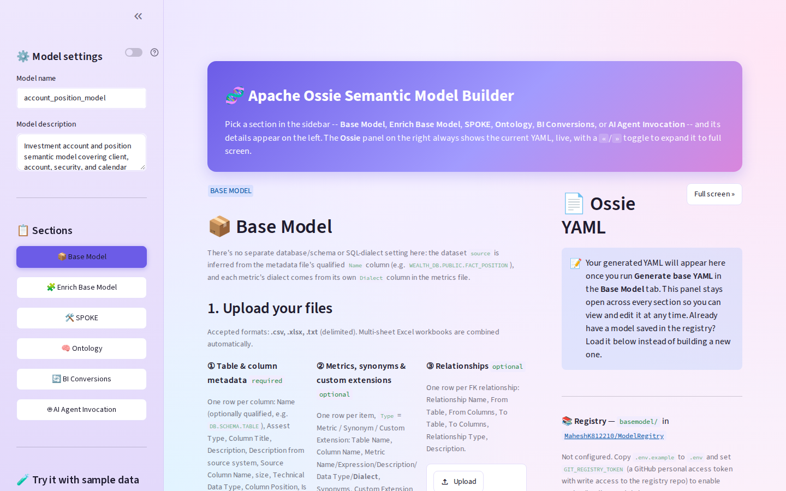
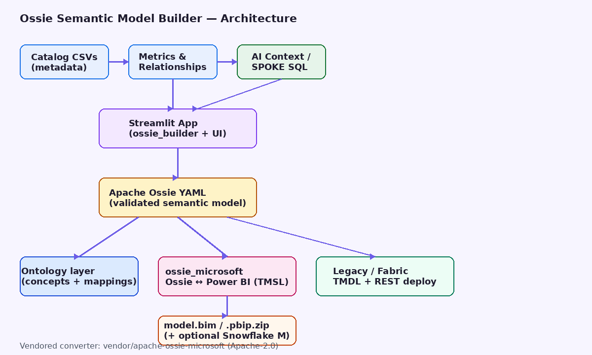
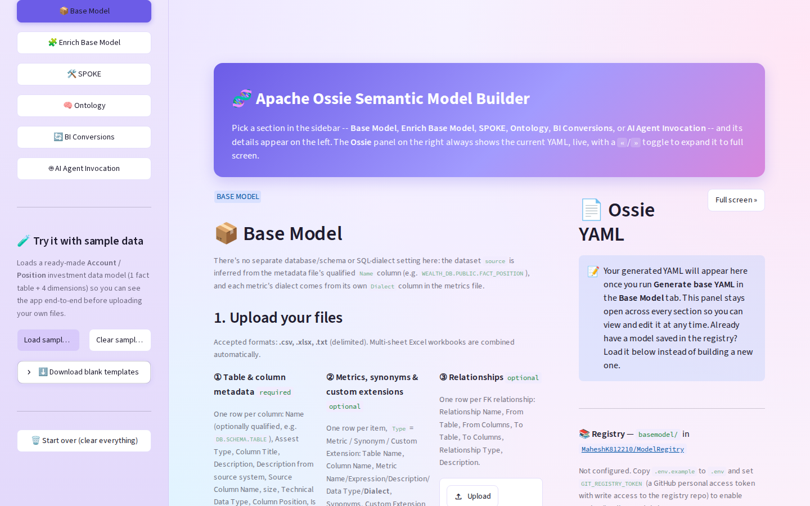
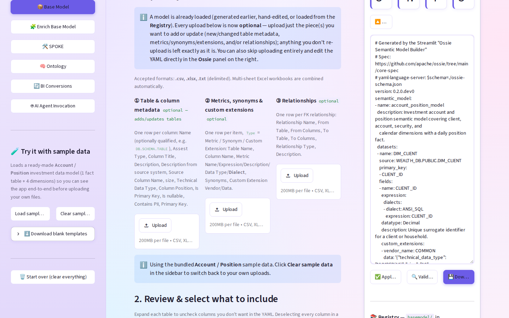
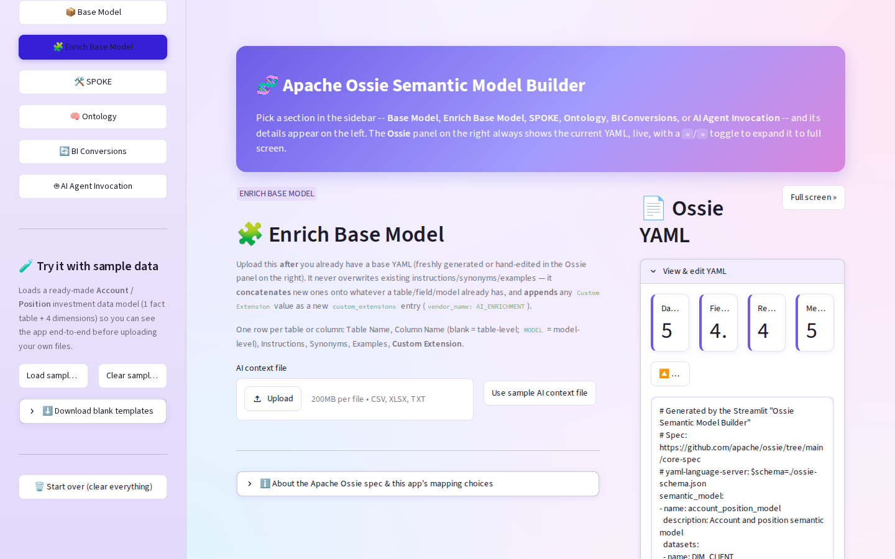
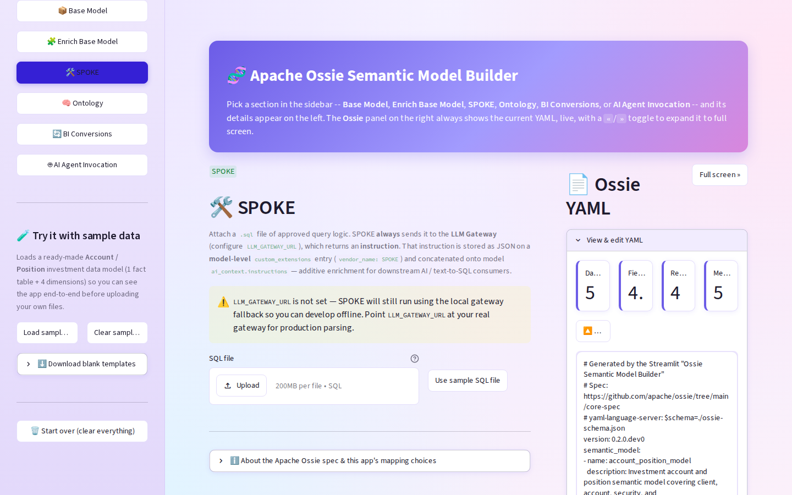
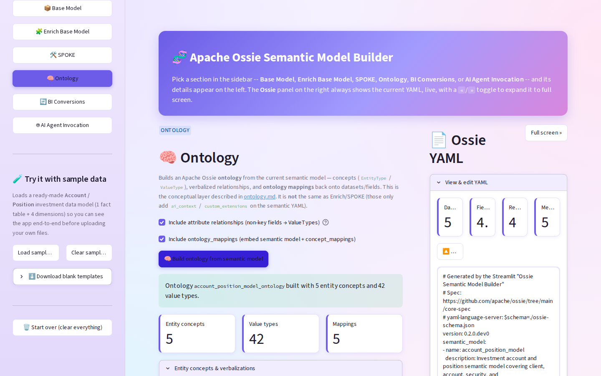
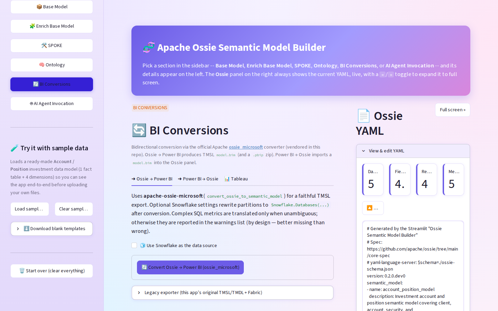
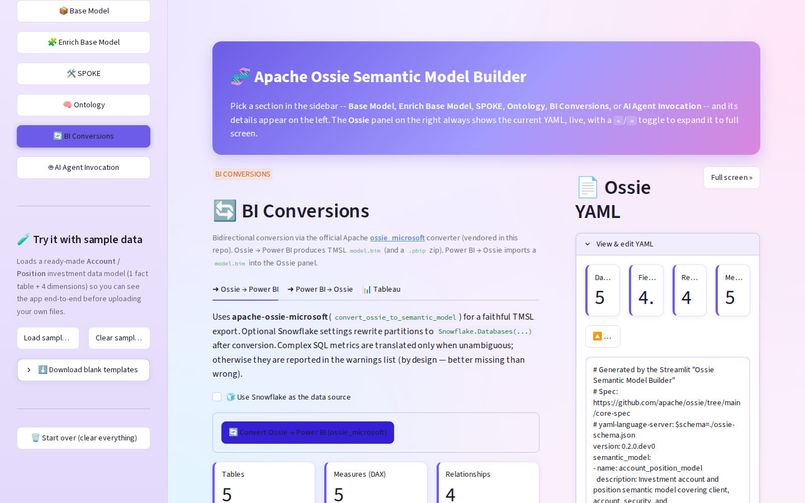
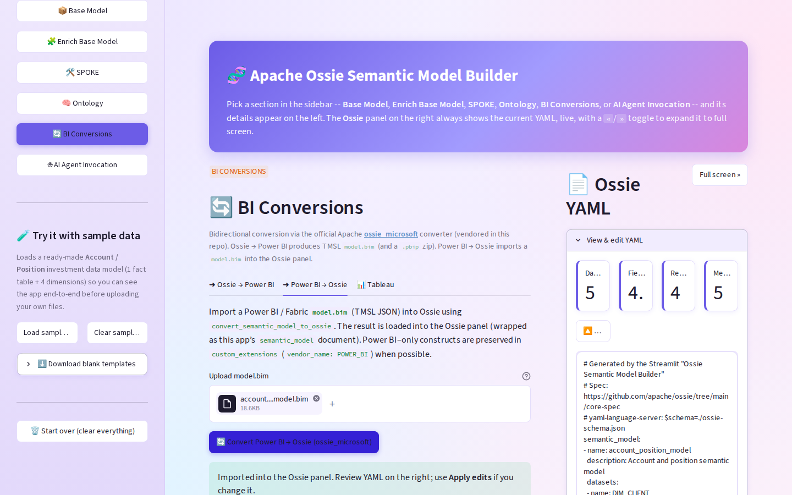

# Ossie Semantic Model Builder — Design, Capabilities & Usage Guide

**Audience:** Data platform, analytics engineering, BI, and AI/text-to-SQL stakeholders  
**Product:** Apache Ossie (Open Semantic Interchange) Semantic Model Builder  
**Primary UI:** Streamlit web app  
**Spec:** [Apache Ossie core-spec](https://github.com/apache/ossie/tree/main/core-spec) (`0.2.0.dev0`)

> **How to publish this page to Confluence**  
> 1. Create a blank Confluence page.  
> 2. Attach all files from `docs/images/` (or drag them into the page).  
> 3. Paste this Markdown into Confluence using the **Markdown** macro, **or** import the Word file `docs/Ossie_Semantic_Model_Builder_Design_and_Capabilities.docx`.  
> 4. After paste/import, re-link images if needed (Confluence may rename attachments).  
> See also: `docs/HOW_TO_PUBLISH_TO_CONFLUENCE.md`.

---

## 1. Executive summary

The **Ossie Semantic Model Builder** turns catalog-exported spreadsheets into a validated **Apache Ossie** semantic model YAML, then optionally:

- Enriches it with AI context and approved SQL (SPOKE)
- Derives an **ontology** layer from FACT/DIM tables
- Converts **bidirectionally** to/from **Power BI** using the official Apache **`ossie_microsoft`** converter (TMSL `model.bim` / `.pbip`)

**Business benefit:** one governed semantic definition that can feed BI (Power BI / Fabric) and AI/text-to-SQL consumers without hand-building models twice.



*Figure 1 — Application home: sidebar sections, Base Model upload area, Ossie YAML panel.*

---

## 2. Problem & benefits

### Pain points addressed

| Pain | Without this tool | With this tool |
|---|---|---|
| Semantic models live only in Power BI | Hard to reuse for AI / SQL agents | Ossie YAML is the portable source of truth |
| Catalog → BI is manual | Weeks of Tabular modeling | CSV → validated Ossie → TMSL in minutes |
| Metrics drift across tools | Different DAX vs SQL definitions | Metrics captured once; converter translates where safe |
| Public-repo import blocked | Cannot pull Apache packages live | Converter **vendored** under `vendor/apache-ossie-microsoft` |
| Round-trip from Fabric/PBI | Rebuild Ossie by hand | Upload `model.bim` → Ossie panel |

### Key benefits

1. **Single semantic layer** — datasets, fields, relationships, metrics, AI context in one YAML.  
2. **Official Microsoft path** — uses Apache `ossie_microsoft` for Ossie ↔ Power BI (not a one-off hack).  
3. **Org-friendly packaging** — no need to import the public `apache/ossie` repo; source is committed locally.  
4. **Snowflake-aware export** — optional post-process to `Snowflake.Databases(...)` M partitions.  
5. **Validation** — JSON Schema validation against bundled Ossie schemas.  
6. **Demoable end-to-end** — sample Account/Position model with one click.

---

## 3. Architecture & design



*Figure 2 — High-level architecture: catalog inputs → Streamlit builder → Ossie YAML → Ontology / Power BI / Fabric paths.*

### Design principles

1. **Ossie-first** — the app’s native document is `{"semantic_model":[...]}`; BI formats are exports/imports.  
2. **Additive enrichment** — Enrich / SPOKE append context; they do not wipe the base model.  
3. **Official converter for interchange** — `ossie_microsoft` owns SQL→DAX safety rules and POWER_BI stash round-trip.  
4. **Legacy path retained** — in-repo `powerbi_export.py` + `fabric_deploy.py` for TMDL + Fabric REST when needed.  
5. **No secrets in exports** — Snowflake account/warehouse only; Power BI prompts for credentials on refresh.

### Major components

| Component | Role |
|---|---|
| `app.py` | Streamlit UI (sections, YAML panel, registry) |
| `ossie_builder.py` | CSV/XLSX → Ossie model, merge, validate |
| `ontology_builder.py` | Semantic model → Ossie ontology + mappings |
| `llm_gateway.py` | SPOKE: SQL → instruction JSON via LLM gateway |
| `ossie_microsoft_bridge.py` | Unwrap/wrap app models; call official converter; PBIP zip; Snowflake M |
| `vendor/apache-ossie-microsoft/` | Official Apache converter (Apache-2.0) |
| `powerbi_export.py` | Legacy TMSL/TMDL export + metric preview |
| `fabric_deploy.py` | Legacy Fabric REST deploy (TMDL) |
| `git_registry.py` | Optional GitHub Contents API save/load |

### Document shapes (important)

- **This app** stores: `{"semantic_model": [ { name, datasets, relationships, metrics, ... } ]}`  
- **`ossie_microsoft`** expects a **flat** Ossie document: `{ version, name, datasets, ... }`  
- The bridge **unwraps** on export and **wraps** on import so the UI stays consistent.

---

## 4. Capabilities by section

### 4.1 Base Model

Upload catalog extracts → generate validated Ossie YAML.

1. Table & column metadata (**required**)  
2. Metrics, synonyms & custom extensions (optional)  
3. Relationships (optional)



*Figure 3 — Sample Account/Position metadata loaded; tree selection of tables/columns.*



*Figure 4 — After **Generate base YAML**: live Ossie panel with datasets, fields, relationships, metrics.*

**Capabilities**

- Infers dataset `source` from qualified `Name` (e.g. `WEALTH_DB.PUBLIC.FACT_POSITION`)  
- Maps technical types → Ossie datatypes  
- Supports **Source Column Name** vs logical **Column Title** for Power BI `sourceColumn`  
- On-demand **Validate YAML** against `schema/ossie-schema.json`  
- Editable YAML + **Apply edits**

### 4.2 Enrich Base Model

Layer AI/business context without overwriting the base.



*Figure 5 — Enrich Base Model: upload AI context CSV to append instructions, synonyms, examples.*

### 4.3 SPOKE

Attach approved `.sql` → LLM Gateway → model-level `custom_extensions` (`vendor_name: SPOKE`).



*Figure 6 — SPOKE section: SQL attachment and enrichment into the semantic model for downstream AI.*

### 4.4 Ontology

Derive conceptual **EntityType / ValueType** ontology + mappings from FACT/DIM semantic model.



*Figure 7 — Ontology section: conceptual layer alongside (not replacing) the semantic YAML.*

### 4.5 BI Conversions (Ossie ↔ Power BI)

Bidirectional conversion via official **`ossie_microsoft`**.



*Figure 8 — BI Conversions entry: Ossie → Power BI, Power BI → Ossie, Tableau (placeholder).*

#### Ossie → Power BI

- Calls `convert_ossie_to_semantic_model`  
- Downloads **`model.bim` (TMSL)** and **`.pbip.zip`**  
- Optional Snowflake partition rewrite  
- Shows converter warnings (by design: skip ambiguous SQL rather than emit wrong DAX)  
- Legacy exporter (TMDL / Fabric / synthetic metrics) remains in an expander



*Figure 9 — Successful Ossie → Power BI: tables / measures / relationships + downloads.*

#### Power BI → Ossie

- Upload Fabric / Desktop **`model.bim`**  
- Calls `convert_semantic_model_to_ossie`  
- Loads wrapped model into the Ossie panel  
- Power BI–only constructs preserved in `custom_extensions` (`POWER_BI`) when possible



*Figure 10 — Power BI → Ossie import success and YAML reload.*

### 4.6 Fabric deployment (current state)

| Path | Format | Fabric REST in UI? |
|---|---|---|
| Official `ossie_microsoft` | TMSL (`model.bim`) | Not wired in UI yet (engine exists in vendor package) |
| Legacy expander | TMDL via `fabric_deploy.py` | Yes — workspace ID + bearer token |

**Note:** Fabric accepts **both TMSL and TMDL**. TMDL is preferred for git-oriented projects; TMSL remains the interchange/API format used by the official converter.

### 4.7 AI Agent Invocation

Placeholder for future NL Q&A against the current Ossie model.

---

## 5. TMSL vs TMDL (for stakeholders)

| | **TMSL** | **TMDL** |
|---|---|---|
| What | JSON (`model.bim`) | Folder of `.tmdl` text files |
| Age | Established Tabular scripting format | Newer project/source format |
| Best for | Converters, APIs, Tabular Editor, round-trip | Fabric/Power BI Project git workflows |
| This app’s official path | **Yes (primary)** | Legacy / Fabric deploy path |

**Why this tool uses TMSL for Ossie ↔ Power BI:** the official Apache `ossie_microsoft` converter’s public API is TMSL in / TMSL out. That is the correct interchange choice; TMDL remains available for Fabric-oriented legacy packaging.

---

## 6. End-to-end usage (happy path)

1. Start app: `pip install -r requirements.txt && streamlit run app.py` → `http://localhost:47531`  
2. Sidebar → **Load sample data** (or upload your catalog CSVs)  
3. **Generate base YAML** → review Ossie panel → **Validate YAML**  
4. Optional: Enrich / SPOKE / Ontology  
5. **BI Conversions** → **Convert Ossie → Power BI** → download `model.bim` or `.pbip.zip`  
6. Open in Power BI Desktop (*File → Open → Power BI Project*) or Tabular Editor  
7. Optional reverse: upload `model.bim` → **Convert Power BI → Ossie**

### Snowflake refresh path

1. Check **Use Snowflake as the data source**  
2. Enter Account URL + Warehouse (+ optional Role)  
3. Convert — partitions become `Snowflake.Databases(...)` M  
4. Credentials are **not** stored; Power BI prompts on first refresh

---

## 7. Inputs & outputs

### Inputs (sample templates under `sample_data/`)

| File | Purpose |
|---|---|
| `01_table_column_metadata.csv` | Tables/columns (required) |
| `02_metrics_synonyms_extensions.csv` | Metrics, synonyms, extensions |
| `03_relationships.csv` | FK relationships |
| `04_ai_context.csv` | Enrichment |
| `05_spoke_*.sql` | SPOKE SQL |
| `06_*_ontology.yaml` | Sample ontology |

### Outputs

| Artifact | Producer |
|---|---|
| Ossie semantic YAML | Base / Enrich / SPOKE / import |
| Ontology YAML | Ontology section |
| `model.bim` (TMSL) | Official converter |
| `.pbip.zip` | Bridge packaging |
| TMDL + Fabric deploy | Legacy path |

---

## 8. Security & governance notes

- Uploaded files stay in-session memory (Streamlit process); not uploaded to third parties by default.  
- LLM Gateway / Git registry tokens via `.env` (see `.env.example`) — never baked into exports.  
- Converter warnings should be reviewed before production deploy (unsupported extensions, ambiguous metrics).  
- Vendored Apache software retains `LICENSE` / `NOTICE` under `vendor/apache-ossie-microsoft/`.

---

## 9. Limitations (honest)

- Tableau export is not implemented.  
- Official UI path does not yet expose Fabric REST deploy (legacy expander does).  
- Composite keys reduce to Tabular single-column relationships where needed.  
- SQL→DAX only when unambiguous; complex SQL may appear as warnings rather than measures.  
- Blank `.pbip` report scaffold is best-effort; `model.bim` alone remains usable via Tabular Editor.

---

## 10. Runbook

```bash
git checkout cursor/ossie-yaml-streamlit-app-7d77
pip install -r requirements.txt
streamlit run app.py
# opens http://localhost:47531 (see .streamlit/config.toml)
pytest   # optional
```

Editable install of the official converter is included via:

```text
-e ./vendor/apache-ossie-microsoft
```

in `requirements.txt`.

---

## 11. Related links

- Apache Ossie core spec: https://github.com/apache/ossie/tree/main/core-spec  
- Official Microsoft converter: https://github.com/apache/ossie/tree/main/converters/microsoft  
- Fabric semantic model REST API: https://learn.microsoft.com/en-us/rest/api/fabric/semanticmodel/items/create-semantic-model  
- Project README: repository root `README.md`

---

*Document version: 1.0 — generated for Confluence / stakeholder review.*
